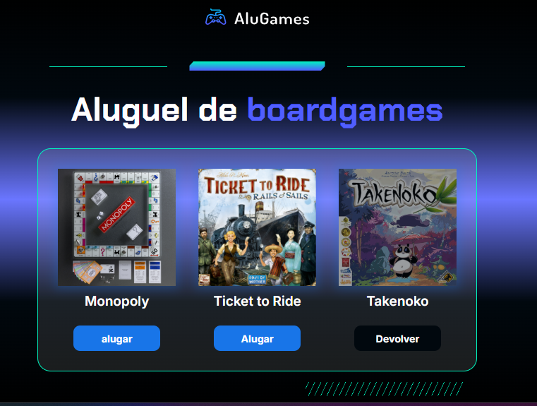
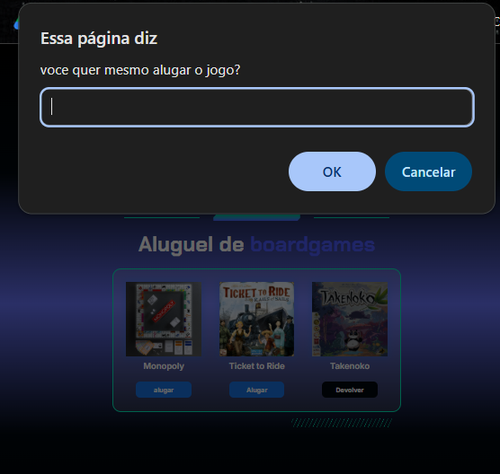

# Alugames

## Sobre o projeto
Aplicação web interativa desenvolvida para gerenciar o aluguel e a devolução de jogos, permitindo alternar estados visuais e validar ações do usuário por meio de confirmações.

## O que aprendi aqui
- Manipulação de DOM com JavaScript (`getElementById`, `querySelector`)
- Gerenciamento de classes CSS com `classList` (`contains`, `toggle`)
- Uso de estruturas condicionais (`if/else`) para controle de fluxo
- Tratamento de entradas do usuário com `prompt()` e manipulação de strings (`toLowerCase()`)
- Lógica de programação na prática

## Tecnologias
- HTML5
- CSS3
- JavaScript

## Como executar
1. Clone o repositório
2. Abra o arquivo `index.html` no navegador

## Print

Feito durante os estudos na Alura e refatorado por mim.