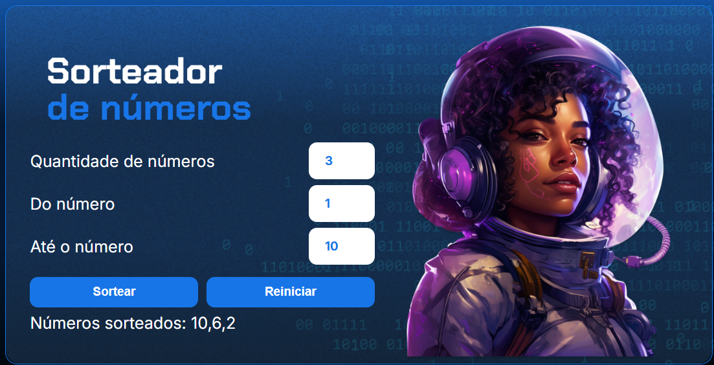

# Sorteador de Números

## Sobre o projeto
Aplicação web que gera um número aleatório entre um valor mínimo e máximo definido pelo usuário.

## O que aprendi aqui
- Manipulação de DOM com JavaScript
- Validação de inputs do usuário
- Uso de `Math.random()` e `Math.floor()`
- Lógica de programação na prática

## Tecnologias
- HTML5
- CSS3
- JavaScript

## Como executar
1. Clone o repositório
2. Abra o arquivo `index.html` no navegador

## Print

Feito durante os estudos na Alura e refatorado por mim.